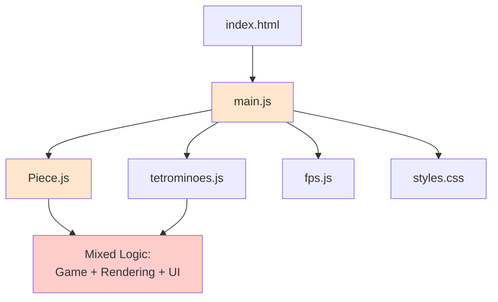
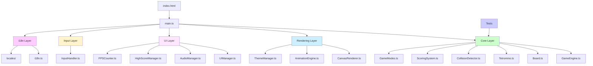

# Tetris Modern V2 - Migration Plan

## Overview

Complete refactor of Tetris project in vanilla TypeScript with modern architecture, Vitest tests, UX improvements (animations, themes, sounds), and optimized Netlify deployment.

## Architecture

```
src/
├── core/              # Game engine (pure logic)
│   ├── Board.ts
│   ├── Tetromino.ts
│   ├── GameEngine.ts
│   ├── CollisionDetector.ts
│   ├── ScoringSystem.ts
│   └── GameModes.ts
├── rendering/         # Canvas rendering
│   ├── CanvasRenderer.ts
│   ├── AnimationEngine.ts
│   └── ThemeManager.ts
├── input/
│   └── InputHandler.ts
├── ui/
│   ├── UIManager.ts
│   ├── AudioManager.ts
│   ├── MusicManager.ts
│   ├── HighScoreManager.ts
│   └── FPSCounter.ts
├── i18n/              # Internationalization
│   ├── i18n.ts
│   └── locales/
│       ├── fr.ts
│       └── en.ts
├── types/
│   └── index.ts
├── constants/
│   └── config.ts
├── styles/
│   ├── main.scss
│   ├── abstracts/
│   ├── base/
│   └── components/
└── main.ts
```

## Comparison: Before vs After

### Before (V1 - Vanilla JS)



**Characteristics:**
- Vanilla JavaScript (no typing)
- Mixed concerns in single files
- No test coverage
- Basic CSS styling
- Manual FPS counter
- French only

### After (V2 - TypeScript Modern)



**Characteristics:**
- TypeScript strict mode
- Clean separation of concerns
- Unit tests (Vitest)
- Modern SCSS architecture
- Integrated FPS counter
- Multi-language (FR/EN)
- Optimized Vite build

## Tech Stack

- **Language**: TypeScript (strict mode)
- **Build**: Vite
- **Tests**: Vitest
- **Styles**: SCSS with modules
- **i18n**: Custom lightweight solution
- **Deployment**: Netlify
- **Linting**: ESLint + Prettier
- **Commits**: Commitlint with conventional commits

## Key Improvements

### Architecture
- **Clean separation**: Game engine, rendering, UI are independent
- **Testability**: Pure functions and dependency injection enable testing
- **Immutability**: Game state updates create new objects
- **Event-driven**: Loose coupling through event emitters
- **SOLID principles**: Single responsibility, open for extension

### UX Enhancements
- Ghost piece preview
- Hold piece functionality
- Next piece preview
- Session statistics
- Smooth animations
- Multiple themes
- Responsive design
- Touch controls for mobile
- Independent audio controls (music + SFX)
- FPS counter
- Modal close buttons

### Developer Experience
- TypeScript strict mode
- ESLint + Prettier
- Vitest for testing
- Hot Module Replacement (HMR)
- Source maps
- Conventional commits

---

<details>
<summary><strong>📋 Detailed Migration Tasks</strong> (click to expand)</summary>

### Setup & Configuration ✅
- [x] Initialize tetris-v2 project with Vite, TypeScript, Vitest, SCSS
- [x] Configure tsconfig, vite.config, netlify.toml, ESLint, Prettier
- [x] Define TypeScript types and game constants

### Core Game Engine ✅
- [x] Migrate tetrominoes.js to Tetromino.ts with types
- [x] Create Board.ts with grid logic and state management
- [x] Extract collision logic to CollisionDetector.ts
- [x] Migrate scoring system to ScoringSystem.ts
- [x] Create GameEngine.ts orchestrating all business logic
- [x] Write Vitest unit tests for core modules

### Rendering Layer ✅
- [x] Create CanvasRenderer.ts for decoupled display
- [x] Implement AnimationEngine with modern visual effects
- [x] Create ThemeManager with multi-theme support

### Input & UI ✅
- [x] Migrate keyboard/touch controls to InputHandler.ts
- [x] Create UIManager for score display, modals, etc.
- [x] Implement AudioManager with optional sounds and music
- [x] Migrate high score system to HighScoreManager.ts

### Styles & Design ✅
- [x] Create SCSS architecture with modern responsive design
- [x] Add UX enhancements (preview piece, ghost piece, hold, statistics)

### Features ✅
- [x] Implement Ultra Mode (2 minutes, maximum points)
- [x] Setup i18n system with FR/EN support
- [x] Create translation files and adapt all texts

### Integration ✅
- [x] Integrate all modules in main.ts and index.html
- [x] Write professional README.md with before/after comparison
- [x] Test and optimize Netlify deployment
- [x] Cross-browser testing, performance audit, code cleanup

### Additional Features ✅
- [x] Add FPS counter display
- [x] Add modal close buttons with proper styling
- [x] Add commitlint configuration

</details>

---

*Migration completed: From vanilla JavaScript monolith to modern TypeScript architecture*
