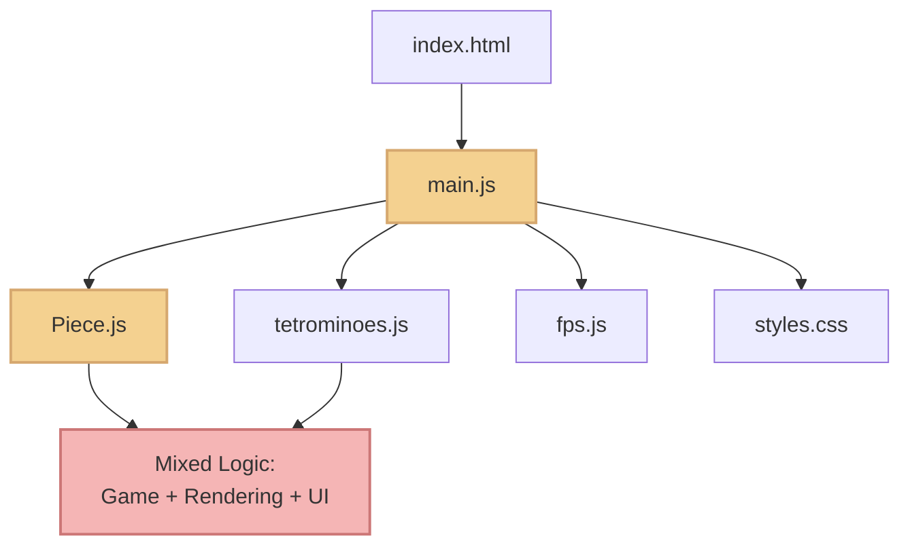
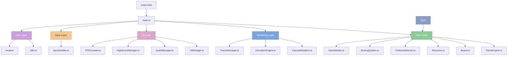

# 🎮 Simplistic Tetris V2


> **Modern rewrite of my [original Tetris project](https://github.com/KevOneRedOne/Simplistic-Javascript-Tetris).** Rebuilding a fun project to create a production-ready game playable anywhere, anytime, while showcasing clean architecture and modern development practices.

[🎮 **Play Live Demo**](https://simplistic-tetris-v2.netlify.app) | [📝 Original Version](https://github.com/KevOneRedOne/Simplistic-Javascript-Tetris) | [📚 Documentation](./docs/)

---

## 📸 Screenshots

<div align="center">
  
  <p><em>Modern start screen with game mode selection</em></p>
  
  
  <p><em>Gameplay with next piece preview, hold system, and statistics</em></p>
</div>

---

## ✨ Key Features

- 🎮 **Two Game Modes** - Classic (infinite) and Ultra (2-minute challenge)
- 👻 **Ghost Piece** - See where your piece will land
- 💾 **Hold System** - Save a piece for later use
- 🎨 **4 Themes** - Classic, Dark, Neon, Retro
- 🌍 **i18n Support** - French and English with extensible system
- 📱 **Fully Responsive** - Touch controls for mobile devices
- 🎵 **Audio System** - Background music and sound effects
- 📊 **FPS Counter** - Real-time performance monitoring
- 🏆 **High Scores** - Persistent leaderboard per game mode

---

## 🏗️ Architecture Evolution

### From Monolith to Modular

<details>
<summary><strong>🔴 Before (V1 - Vanilla JS)</strong> - Click to view diagram</summary>



**Characteristics:**
- ❌ Vanilla JavaScript (no typing)
- ❌ Mixed concerns in single files
- ❌ No test coverage
- ❌ Basic CSS styling
- ❌ Manual FPS counter
- ❌ French only

</details>

<details>
<summary><strong>🟢 After (V2 - TypeScript Modern)</strong> - Click to view diagram</summary>



**Characteristics:**
- ✅ TypeScript strict mode
- ✅ Clean separation of concerns
- ✅ Unit tests (Vitest)
- ✅ Modern SCSS architecture
- ✅ Integrated FPS counter
- ✅ Multi-language (FR/EN)
- ✅ Optimized Vite build

</details>

### Project Structure

```mermaid
graph TB
    subgraph "src/"
        subgraph "core/ - Game Engine"
            C1[Board.ts]
            C2[Tetromino.ts]
            C3[GameEngine.ts]
            C4[CollisionDetector.ts]
            C5[ScoringSystem.ts]
            C6[GameModes.ts]
        end
        
        subgraph "rendering/ - Canvas"
            R1[CanvasRenderer.ts]
            R2[AnimationEngine.ts]
            R3[ThemeManager.ts]
        end
        
        subgraph "ui/ - User Interface"
            U1[UIManager.ts]
            U2[AudioManager.ts]
            U3[MusicManager.ts]
            U4[HighScoreManager.ts]
            U5[FPSCounter.ts]
        end
        
        subgraph "input/"
            I1[InputHandler.ts]
        end
        
        subgraph "i18n/ - Internationalization"
            L1[i18n.ts]
            L2[locales/fr.ts]
            L3[locales/en.ts]
        end
        
        subgraph "config/"
            CF1[types/index.ts]
            CF2[constants/config.ts]
        end
        
        subgraph "styles/ - SCSS"
            S1[main.scss]
            S2[abstracts/]
            S3[base/]
            S4[components/]
        end
        
        M[main.ts]
    end
    
    T[tests/] -.-> C3
    
    style C1 fill:#8fc994,stroke:#5a9,stroke-width:2px,color:#fff
    style C2 fill:#8fc994,stroke:#5a9,stroke-width:2px,color:#fff
    style C3 fill:#8fc994,stroke:#5a9,stroke-width:2px,color:#fff
    style C4 fill:#8fc994,stroke:#5a9,stroke-width:2px,color:#fff
    style C5 fill:#8fc994,stroke:#5a9,stroke-width:2px,color:#fff
    style C6 fill:#8fc994,stroke:#5a9,stroke-width:2px,color:#fff
    style R1 fill:#7ba4db,stroke:#4a8ad6,stroke-width:2px,color:#fff
    style R2 fill:#7ba4db,stroke:#4a8ad6,stroke-width:2px,color:#fff
    style R3 fill:#7ba4db,stroke:#4a8ad6,stroke-width:2px,color:#fff
    style U1 fill:#d9a7c7,stroke:#c77aa4,stroke-width:2px,color:#fff
    style U2 fill:#d9a7c7,stroke:#c77aa4,stroke-width:2px,color:#fff
    style U3 fill:#d9a7c7,stroke:#c77aa4,stroke-width:2px,color:#fff
    style U4 fill:#d9a7c7,stroke:#c77aa4,stroke-width:2px,color:#fff
    style U5 fill:#d9a7c7,stroke:#c77aa4,stroke-width:2px,color:#fff
    style I1 fill:#f4c790,stroke:#d6a86f,stroke-width:2px,color:#333
    style L1 fill:#c9a0dc,stroke:#a67bc8,stroke-width:2px,color:#fff
    style L2 fill:#c9a0dc,stroke:#a67bc8,stroke-width:2px,color:#fff
    style L3 fill:#c9a0dc,stroke:#a67bc8,stroke-width:2px,color:#fff
    style T fill:#8b9dc3,stroke:#6a7fa8,stroke-width:2px,color:#fff
```

<details>
<summary><strong>📁 Detailed File Organization</strong> - Click to expand</summary>



**Design Patterns:**
- 🏭 Factory Pattern (Tetromino creation)
- 👁️ Observer Pattern (Event-driven game events)
- 🔒 Singleton Pattern (i18n, ThemeManager)
- 🎯 Strategy Pattern (Game modes)
- 📦 Module Pattern (Organized file structure)

</details>

---

## 🚀 Quick Start

### Prerequisites

- Node.js 18+ 
- npm or yarn

### Installation

```bash
# Clone the repository
git clone https://github.com/KevOneRedOne/Simplistic-Tetris.git
cd Simplistic-Tetris

# Install dependencies
npm install

# Start development server
npm run dev

# Open http://localhost:5173
```

### Available Scripts

```bash
npm run dev          # Start dev server with HMR
npm run build        # Build for production
npm run preview      # Preview production build
npm test             # Run unit tests
npm run test:ui      # Run tests with UI
npm run lint         # Lint code
npm run format       # Format code with Prettier
```

---

## 🎮 How to Play

### Keyboard Controls

| Key | Action |
|-----|--------|
| **← →** | Move left/right |
| **↑** or **Z** | Rotate piece |
| **↓** or **S** | Soft drop |
| **Space** | Hard drop |
| **C** or **Shift** | Hold piece |
| **Esc** or **P** | Pause game |
| **Enter** | Restart game |

### Mobile Controls

- **Swipe left/right**: Move piece
- **Swipe down**: Soft drop  
- **Tap**: Rotate piece

### Game Modes

- **🎮 Classic Mode**: Traditional Tetris. Play until game over. Clear lines to level up.
- **⚡ Ultra Mode**: Time attack. Score maximum points in 2 minutes!

---

## 🛠️ Tech Stack

<details>
<summary><strong>Core Technologies</strong></summary>

- **TypeScript 5.x** - Strict mode for type safety
- **Vite 6.x** - Fast build tool with HMR
- **Vitest** - Unit testing framework
- **SCSS** - CSS preprocessor with modules
- **Canvas API** - Game rendering

</details>

<details>
<summary><strong>Development Tools</strong></summary>

- **ESLint** - Code linting
- **Prettier** - Code formatting
- **Commitlint** - Conventional commits
- **Netlify** - Deployment platform

</details>

<details>
<summary><strong>Architecture Principles</strong></summary>

1. **Separation of Concerns** - Game logic, rendering, and UI are independent
2. **Testability** - Pure functions and dependency injection
3. **Immutability** - Game state updates create new objects
4. **Event-Driven** - Loose coupling through event emitters
5. **SOLID Principles** - Single responsibility, open for extension

</details>

---

## 📊 Comparison Table

| Feature | V1 (Original) | V2 (Modern) |
|---------|---------------|-------------|
| **Language** | Vanilla JS | TypeScript (strict) |
| **Architecture** | Mixed concerns | Clean, separated layers |
| **Testing** | None | Unit tests (Vitest) |
| **Styling** | Basic CSS | SCSS + Design system |
| **Build** | None | Vite with optimizations |
| **Game Modes** | 1 | 2 (Classic + Ultra) |
| **i18n** | French only | FR/EN extensible |
| **Themes** | 1 | 4 themes |
| **Mobile** | Basic | Full touch support |
| **Code Lines** | ~600 | ~3000+ (modular) |
| **Performance** | Good | Optimized (60 FPS) |

---

## 📚 Documentation

- [📖 Migration Plan](./docs/MIGRATION-PLAN.md) - Detailed migration process from V1 to V2
- [🎵 Music Setup](./docs/MUSIC_SETUP.md) - How to add custom background music

---

## 🧪 Testing

```bash
# Run all tests
npm test

# Run tests with UI
npm run test:ui

# Generate coverage report
npm run test:coverage
```

**Test Coverage:**
- Board state management
- Collision detection
- Scoring calculations
- Tetromino rotations

---

## 📈 Performance

- ✅ **Lighthouse Score**: 90+ across all metrics
- ✅ **Bundle Size**: < 150KB gzipped
- ✅ **First Load**: < 1s on 3G
- ✅ **Frame Rate**: Consistent 60 FPS

---

## 🚀 Deployment

The project is configured for **Netlify** with automatic deployments:

- Push to `main` → Auto-deploy
- Optimized asset caching
- Security headers configured
- SPA redirects handled

---

## 🤝 Contributing

This is a portfolio project, but suggestions and feedback are welcome! Feel free to open an issue or submit a pull request.

---

## 📄 License

This project is licensed under the **MIT License** - see the [LICENSE](LICENSE) file for details.

---

## 📫 Contact

**Kevin Alves**

[](https://github.com/KevOneRedOne)
[](https://github.com/KevOneRedOne/Simplistic-Tetris)

---

⭐ **Star this repo** if you found it interesting or useful for your learning journey!

*This project demonstrates my growth as a developer and my ability to refactor legacy code into modern, production-ready applications.*
