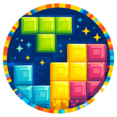
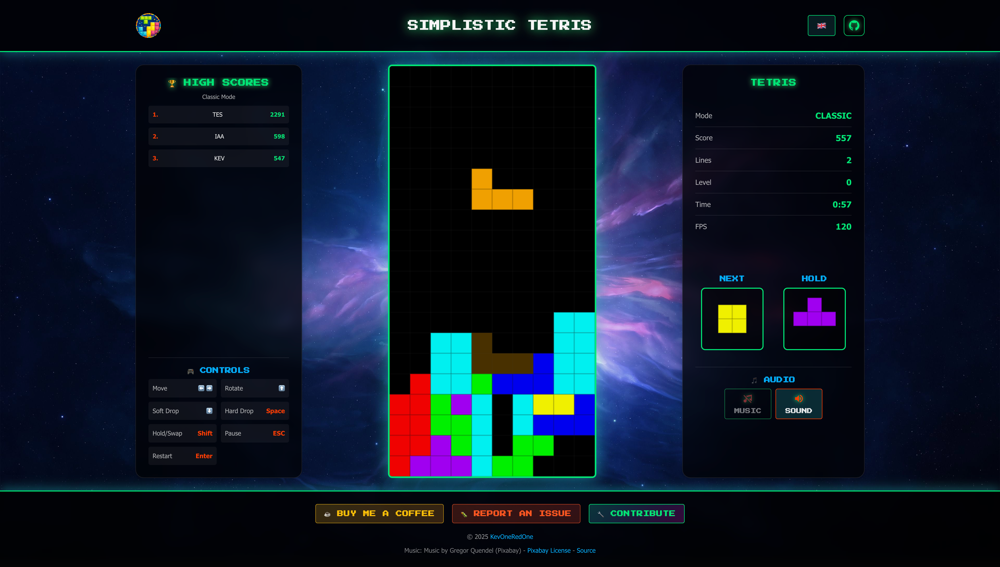
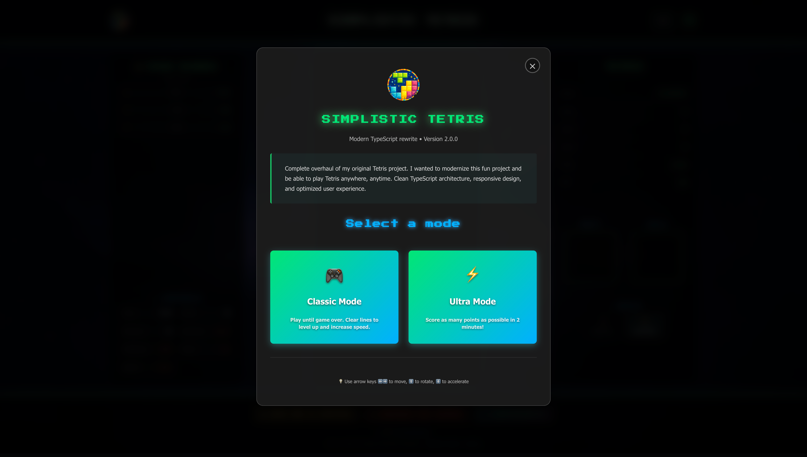
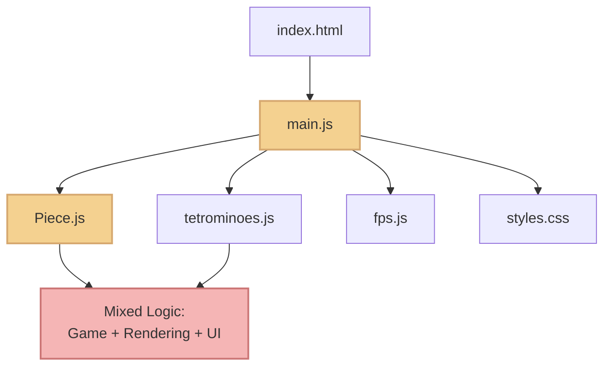
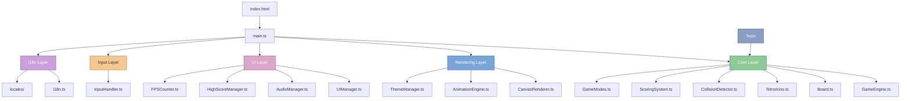

<div align="center">



# Simplistic Tetris V2


<br>

> **Modern rewrite of my [first-year Bachelor's project](https://github.com/KevOneRedOne/Simplistic-Javascript-Tetris).** Rebuilding a fun project to create a production-ready game playable anywhere, anytime, while showcasing clean architecture and modern development practices.

<br>

[🎮 **Play Live Demo (Netlify)**](https://simplistic-tetris.netlify.app) | [📝 Original Version](https://github.com/KevOneRedOne/Simplistic-Javascript-Tetris) | [📚 Documentation](./docs/)

</div>

<div align="center">



</div>

<details>
<summary><strong>📸 More Screenshots</strong> - Click to expand</summary>

<div align="center">


<p><em>Game mode selection screen</em></p>

</div>

</details>

<div align="center">

## 💖 Support

If you enjoy this game, please consider supporting the project. Your support helps me dedicate more time and energy to improve and expand the project.

[](https://buymeacoffee.com/kevoneredone)

</div>


---

## 📖 About The Project

This project is a modern TypeScript rewrite of my first-year Bachelor's group project. It transforms a simple academic project into a production-ready game that demonstrates:

- Clean architecture with separation of concerns
- Modern development practices and patterns
- TypeScript mastery with strict mode
- Professional code organization and testing
- Responsive design and mobile support

### ✨ Key Features

- 🎮 **Two Game Modes** - Classic (infinite) and Ultra (2-minute challenge)
- 👻 **Ghost Piece** - See where your piece will land
- 💾 **Hold System** - Save a piece for later use
- 🎨 **4 Themes** - Classic, Dark, Neon, Retro
- 🌍 **i18n Support** - French and English with extensible system
- 📱 **Fully Responsive** - Adaptive touch controls with gesture support for mobile
- 🎵 **Audio System** - Background music and sound effects
- 📊 **FPS Counter** - Real-time performance monitoring
- 🏆 **High Scores** - Persistent leaderboard per game mode

### 🛠️ Built With

- **TypeScript 5.x** - Strict mode for type safety
- **Vite 6.x** - Fast build tool with HMR
- **Vitest** - Unit testing framework
- **SCSS** - CSS preprocessor with modules
- **Canvas API** - Game rendering

---

## 🚀 Getting Started

### Prerequisites

- Node.js 18+
- npm or yarn

### Installation

1. Clone the repository
   ```bash
   git clone https://github.com/KevOneRedOne/Simplistic-Tetris.git
   cd Simplistic-Tetris
   ```

2. Install dependencies
   ```bash
   npm install
   ```

3. Start development server
   ```bash
   npm run dev
   ```

4. Open [http://localhost:5173](http://localhost:5173)

### Available Scripts

```bash
npm run dev          # Start dev server with HMR
npm run build        # Build for production
npm run preview      # Preview production build
npm test             # Run unit tests
npm run test:ui      # Run tests with UI
npm run lint         # Lint code
npm run format       # Format code with Prettier
```

---

## 🎮 Usage

### How to Play

#### Keyboard Controls

| Key                | Action          |
| ------------------ | --------------- |
| **← →**            | Move left/right |
| **↑**              | Rotate piece    |
| **↓**              | Soft drop       |
| **Space**          | Hard drop       |
| **Shift**          | Hold piece      |
| **Esc** or **P**   | Pause game      |
| **Enter**          | Restart game    |

#### Mobile Controls

- **Swipe left/right** ⬅️➡️: Move piece
- **Swipe down** ⬇️: Soft drop
- **Swipe up** ⬆️: Rotate piece
- **Single tap** 👆: Rotate piece
- **Double tap** 👆👆: Hard drop

> 📱 **Full mobile support** with adaptive swipe sensitivity! See [Mobile Features Guide](./docs/MOBILE-FEATURES.md) for details.

### Game Modes

- **🎮 Classic Mode**: Traditional Tetris. Play until game over. Clear lines to level up.
- **⚡ Ultra Mode**: Time attack. Score maximum points in 2 minutes!

---

## 🏗️ Architecture

### From Monolith to Modular

<details>
<summary><strong>🔴 Before (V1 - Vanilla JS)</strong> - Click to view diagram</summary>



**Characteristics:**

- ❌ Vanilla JavaScript (no typing)
- ❌ Mixed concerns in single files
- ❌ No test coverage
- ❌ Basic CSS styling
- ❌ Manual FPS counter
- ❌ French only

</details>

<details>
<summary><strong>🟢 After (V2 - TypeScript Modern)</strong> - Click to view diagram</summary>



**Characteristics:**

- ✅ TypeScript strict mode
- ✅ Clean separation of concerns
- ✅ Unit tests (Vitest)
- ✅ Modern SCSS architecture
- ✅ Integrated FPS counter
- ✅ Multi-language (FR/EN)
- ✅ Optimized Vite build

</details>

### Architecture Principles

1. **Separation of Concerns** - Game logic, rendering, and UI are independent
2. **Testability** - Pure functions and dependency injection
3. **Immutability** - Game state updates create new objects
4. **Event-Driven** - Loose coupling through event emitters
5. **SOLID Principles** - Single responsibility, open for extension

### Design Patterns

- 🏭 Factory Pattern (Tetromino creation)
- 👁️ Observer Pattern (Event-driven game events)
- 🔒 Singleton Pattern (i18n, ThemeManager)
- 🎯 Strategy Pattern (Game modes)
- 📦 Module Pattern (Organized file structure)

---

## 📚 Documentation

- [🎵 Music Setup](./docs/MUSIC_SETUP.md) - How to add custom background music
- [📱 Mobile Features](./docs/MOBILE-FEATURES.md) - Complete guide to touch controls, responsive design, and mobile optimization

---

## 🧪 Testing

```bash
# Run all tests
npm test

# Run tests with UI
npm run test:ui

# Generate coverage report
npm run test:coverage
```

**Test Coverage:**

- Board state management
- Collision detection
- Scoring calculations
- Tetromino rotations

---

## 🤝 Contributing

This is a portfolio project, but suggestions and feedback are welcome! Feel free to open an issue or submit a pull request.

### How to Contribute

1. 🐛 **Report Bugs**: Use the [bug report template](.github/ISSUE_TEMPLATE/bug_report.md)
2. 💡 **Suggest Features**: Use the [feature request template](.github/ISSUE_TEMPLATE/feature_request.md)
3. 🔧 **Submit PRs**: Follow the [pull request template](.github/pull_request_template.md)

For more details, see our [Contributing Guide](.github/CONTRIBUTING.md).

---

## ☕ Support

If you enjoy this game, consider supporting the project:

- [☕ Buy me a coffee](https://buymeacoffee.com/kevoneredone) - Support with a small donation
- [🐛 Report an issue](https://github.com/KevOneRedOne/Simplistic-Tetris/issues/new/choose) - Help improve the game
- [🔧 Contribute](https://github.com/KevOneRedOne/Simplistic-Tetris) - Submit a pull request
- [💬 Discussions](https://github.com/KevOneRedOne/Simplistic-Tetris/discussions) - Ask questions and share ideas

---

## 📄 License

This project is licensed under the **MIT License** - see the [LICENSE](LICENSE) file for details.

---

## 🙏 Acknowledgments

This project is a modern rewrite of my first-year Bachelor's group project. The original V1 project was built with the help of the following resources:

### Tutorials & Learning Resources

- [Javascript Tetris tutorial](https://www.codeexplained.org/2018/08/create-tetris-game-using-javascript.html) by CodeExplained
- [JSON tutorial](https://www.youtube.com/watch?v=DFhmNLKwwGw) by James Q Quick
- [MDN Web Docs](https://developer.mozilla.org/fr/docs/Web/JavaScript) - JavaScript documentation
- [DevDocs](https://devdocs.io/javascript/) - JavaScript API documentation
- [W3Schools](https://www.w3schools.com/js/default.asp) - JavaScript tutorials
- Lyon YNOV Campus's Object and DOM tutorials
- [Chrono JavaScript tutorial](https://forum.alsacreations.com/topic-5-76681-1-Chronometre-en-Javascript-demarrage-automatique.html) by Alsacréations
- [Best-README-Template] (https://github.com/othneildrew/Best-README-Template) by othneildrew

### Original Project Contributors

The original V1 project was a group effort with:
- Me (KevOneRedOne)
- Djoudi Yanis (Tadayoshi123)
- Moren Yohan (BoSswosile)

---

<div align="center">

⭐ **Star this repo** if you found it interesting or useful for your learning journey!

</div>
