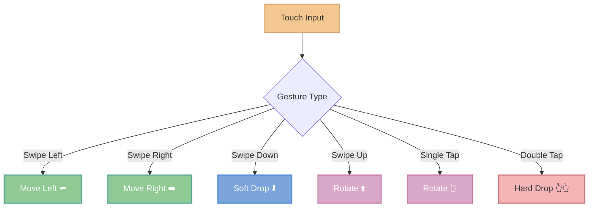
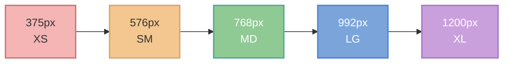
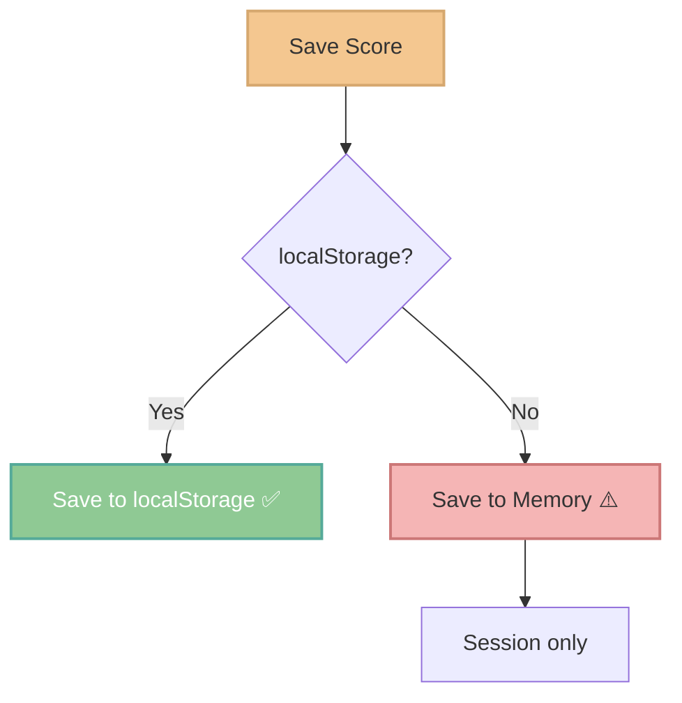

# 📱 Mobile Features & Responsive Design


> **Play Tetris anywhere, anytime.** Full mobile support with intuitive touch controls and adaptive responsive design.

[🎮 Try it on Mobile](https://simplistic-tetris-v2.netlify.app) | [📚 Back to Docs](../README.md)

---

## 🎯 Key Features

| Feature | Description |
|---------|-------------|
| **🔒 Prevent Zoom** | Viewport configuration prevents unwanted zoom |
| **📐 Adaptive Canvas** | Dynamic canvas resizing based on screen size |
| **👆 Touch Gestures** | Swipe & tap controls with adaptive sensitivity |
| **🎨 Compact Layout** | Mobile-first responsive design (< 768px) |
| **🔊 Audio Fix** | AudioContext resume after user interaction |
| **💾 Score Fallback** | In-memory storage when localStorage is blocked |
| **📱 Touch-Friendly** | Minimum 44px buttons (iOS HIG) |

---

## 🎮 Touch Controls

### Gesture Reference



| Gesture | Action | Threshold |
|---------|--------|-----------|
| **Swipe Left** ⬅️ | Move piece left | 20-30px |
| **Swipe Right** ➡️ | Move piece right | 20-30px |
| **Swipe Down** ⬇️ | Soft drop (faster) | 20-30px |
| **Swipe Up** ⬆️ | Rotate clockwise | 20-30px |
| **Single Tap** 👆 | Rotate clockwise | Quick tap |
| **Double Tap** 👆👆 | Hard drop (instant) | < 400ms |

**Adaptive Sensitivity:** Small screens (< 576px) use 20px threshold, larger screens use 30px.

---

## 📱 Responsive Design

### Breakpoint System



**Layout Behavior:**
- **< 576px**: Stacked layout, compact UI, canvas max 90vw
- **576px - 768px**: Two-column side panels, canvas max 400px
- **768px - 992px**: Two-column (stats | board+controls)
- **992px+**: Three-column (stats | board | controls)

### Canvas Auto-Resize

Canvas automatically resizes based on container size while maintaining 10:20 aspect ratio:

```typescript
public autoResize(): void {
  const container = this.canvas.parentElement;
  const maxWidthBasedSize = Math.floor(container.clientWidth / BOARD_COLS);
  const maxHeightBasedSize = Math.floor(container.clientHeight / BOARD_ROWS);
  const optimalCellSize = Math.min(maxWidthBasedSize, maxHeightBasedSize, CELL_SIZE);
  
  if (Math.abs(this.cellSize - optimalCellSize) > 1) {
    this.resize(optimalCellSize);
  }
}
```

**Resize handler:** Debounced 250ms to prevent excessive redraws.

---

## 🔊 Mobile Audio

Mobile browsers block autoplay audio until user interaction.

**Solution:** Resume AudioContext after first user interaction (game start):

```typescript
public async resumeAudioContext(): Promise<void> {
  if (this.audioContext?.state === 'suspended') {
    await this.audioContext.resume();
  }
}
```

Mobile users see a "🔊 Audio activé" notification when audio starts.

---

## 💾 High Scores on Mobile

Some browsers block localStorage in private mode. **Fallback strategy:**



Scores saved to memory are lost on page reload but game remains fully playable.
 
---

## 🐛 Known Issues

| Issue | Status | Solution |
|-------|--------|----------|
| Audio doesn't start on iOS | ✅ Fixed | AudioContext.resume() after interaction |
| Scores not saving in Private Mode | ✅ Fixed | In-memory fallback |
| Lag on older devices | 🟡 Mitigated | Reduced animations |

---

## 💡 Tips for Mobile Players

- 📱 **Portrait mode** for phones, **landscape** for tablets
- 👆 Use **single taps** for quick rotations
- ➡️ Use **swipes** for precise movement
- 👆👆 **Double tap** for instant drop
- 🔊 **Headphones** for best audio experience

---

## 📞 Reporting Issues

Include: Device model, OS version, Browser, Description, Steps to reproduce.

🐛 [GitHub Issues](https://github.com/KevOneRedOne/Simplistic-Tetris/issues)

